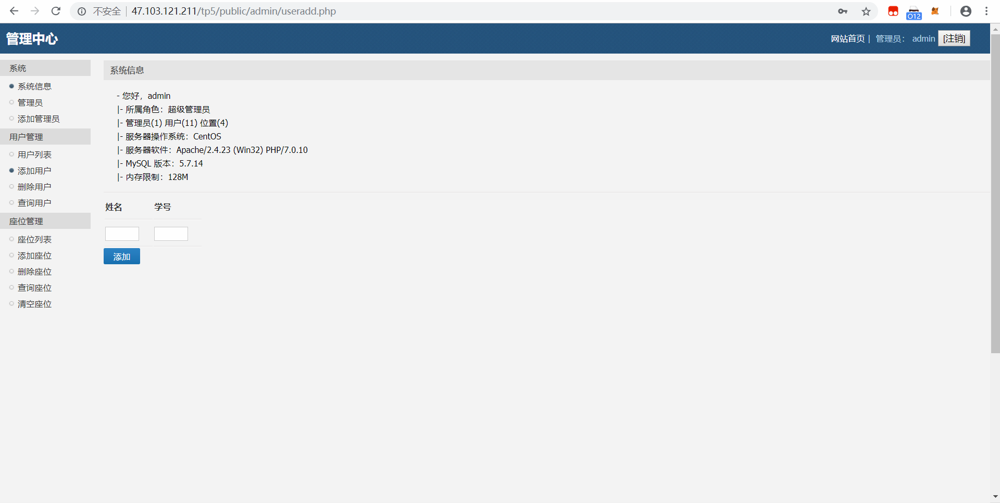

图书馆座位预订后台系统
===============
本项目基于ThinkPHP5上搭建

> ThinkPHP5的运行环境要求PHP5.4以上。

## 目录结构

初始的目录结构如下：

~~~
www  WEB部署目录（或者子目录）
├─application           应用目录
│  ├─common             公共模块目录（可以更改）
│  ├─module_name        模块目录
│  │  ├─config.php      模块配置文件
│  │  ├─common.php      模块函数文件
│  │  ├─controller      控制器目录
│  │  ├─model           模型目录
│  │  ├─view            视图目录
│  │  └─ ...            更多类库目录
│  │
│  ├─command.php        命令行工具配置文件
│  ├─common.php         公共函数文件
│  ├─config.php         公共配置文件
│  ├─route.php          路由配置文件
│  ├─tags.php           应用行为扩展定义文件
│  └─database.php       数据库配置文件
│
├─public                WEB目录（对外访问目录）
│  ├─index.php          入口文件
│  ├─router.php         快速测试文件
│  └─.htaccess          用于apache的重写
│
├─thinkphp              框架系统目录
│  ├─lang               语言文件目录
│  ├─library            框架类库目录
│  │  ├─think           Think类库包目录
│  │  └─traits          系统Trait目录
│  │
│  ├─tpl                系统模板目录
│  ├─base.php           基础定义文件
│  ├─console.php        控制台入口文件
│  ├─convention.php     框架惯例配置文件
│  ├─helper.php         助手函数文件
│  ├─phpunit.xml        phpunit配置文件
│  └─start.php          框架入口文件
│
├─extend                扩展类库目录
├─runtime               应用的运行时目录（可写，可定制）
├─vendor                第三方类库目录（Composer依赖库）
├─build.php             自动生成定义文件（参考）
├─composer.json         composer 定义文件
├─LICENSE.txt           授权说明文件
├─README.md             README 文件
├─think                 命令行入口文件
~~~

## 配置
1.安装WEB服务器(推荐Apache2)，把项目移动到站点目录上

(apache站点目录默认在www)

2.安装MySQL数据库

3.在数据库中分别创建user\seats\orders\admin4张表
表结构如下：

**user:

| Field    | Type             | Null | Key | Default | Extra          |

+----------+------------------+------+-----+---------+----------------+

| id       | int(10) unsigned | NO   | PRI | NULL    | auto_increment |

| usernum  | varchar(40)      | NO   |     | NULL    |                |

| username | varchar(40)      | NO   |     | NULL    |                |

**seats:

| Field   | Type             | Null | Key | Default | Extra          |

+---------+------------------+------+-----+---------+----------------+

| id      | int(10) unsigned | NO   | PRI | NULL    | auto_increment |

| floor   | int(11)          | NO   |     | NULL    |                |

| seat_id | int(11)          | NO   |     | NULL    |                |

**orders:

| Field      | Type             | Null | Key | Default | Extra          |

+------------+------------------+------+-----+---------+----------------+

| id         | int(10) unsigned | NO   | PRI | NULL    | auto_increment |

| user_id    | int(10) unsigned | NO   |     | NULL    |                |

| floor      | int(10) unsigned | NO   |     | NULL    |                |

| seat_id    | int(10) unsigned | NO   |     | NULL    |                |

| date       | date             | NO   |     | NULL    |                |

| start_time | time             | NO   |     | NULL    |                |

| end_time   | time             | NO   |     | NULL    |                |

**admin:

| Field    | Type             | Null | Key | Default | Extra          |

+----------+------------------+------+-----+---------+----------------+

| id       | int(10) unsigned | NO   | PRI | NULL    | auto_increment |

| user     | char(20)         | NO   |     | NULL    |                |

| password | char(20)         | NO   |     | NULL    |                |

4.修改数据库配置
打开tp5/application/database.php
修改以下内容:

// 数据库类型

'type'            => 'mysql',

// 服务器地址

'hostname'        => 'your_IPaddress',

// 数据库名

'database'        => 'your_DatabaseName',

// 用户名

'username'        => 'Your_user_name',

// 密码

'password'        => 'Your_Password',

5.配置成功

访问首页URL地址http://YourIPAddress/tp5/public/admin

用户名默认admin，密码默认123456

;

## 版权信息

本项目包含的第三方源码和二进制文件之版权信息另行标注。

版权所有Copyright © 2008-2019 by LiGaoMing

All rights reserved。
